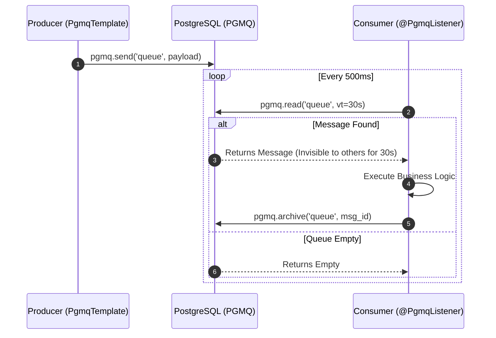
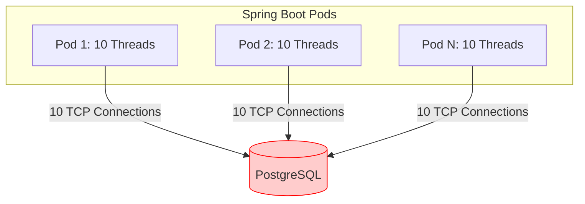
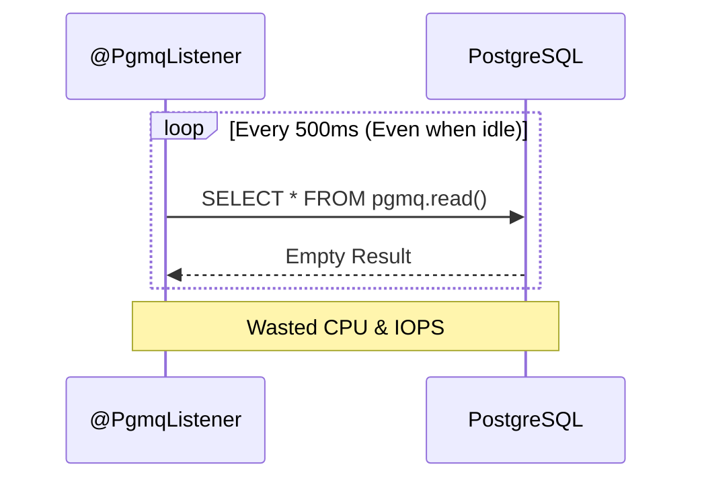
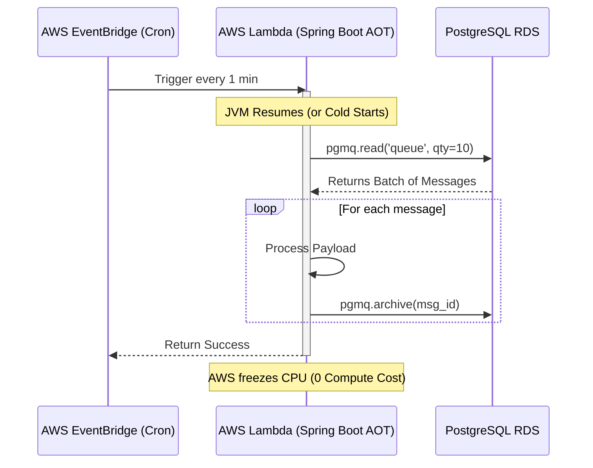
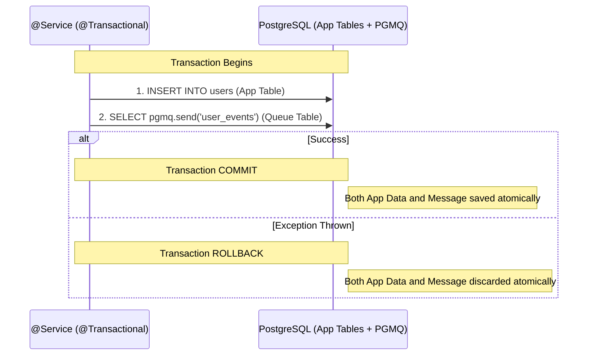

<div align="center">
  <h1>🐘 PGMQ Spring Boot Starter</h1>
  <p><b>An idiomatic Spring Boot integration for the PostgreSQL Message Queue (PGMQ) extension.</b></p>
</div>

<br/>

> ⚠️ **Project Status: Early Development (v0.0.1)**
> 
> This library implements advanced enterprise messaging patterns (Outbox, Idempotency, Exponential Backoff), but it is currently in its **early beta** phase. It has been heavily tested via automated integration suites, but **has not yet been battle-tested in high-scale production environments**. 
> 
> We encourage early adopters to test it, report bugs, and contribute. Please evaluate thoroughly before relying on it for mission-critical data.

---

> **Replace Kafka or RabbitMQ with Postgres.** If your application already uses PostgreSQL, you can get highly reliable, distributed asynchronous messaging without deploying any new infrastructure.

This library acts as a native Spring Boot Auto-Configuration module bridging the gap between the [PGMQ](https://github.com/tembo-io/pgmq) extension and the Spring ecosystem. It provides an intuitive `@PgmqListener` annotation and a powerful `PgmqTemplate`, mirroring the developer experience of Spring Kafka or Spring AMQP, while unlocking the ACID guarantees of PostgreSQL.

---

## ✨ Features at a Glance

- **Declarative Consumers:** Simply annotate methods with `@PgmqListener(queue = "my_queue")`.
- **Transactional Outbox Built-in:** Send messages safely within your standard `@Transactional` database methods.
- **Poison Pill Handling:** Automatic routing to Dead Letter Queues (DLQ) after a configurable number of retries.
- **Exponential Backoff:** Circuit-break failing external APIs by dynamically scaling visibility timeouts.
- **Exactly-Once Delivery:** Built-in idempotency repository to prevent duplicate message processing.
- **High Throughput Batching:** Process messages in bulk by accepting `List<T>` parameters.
- **Concurrent Consumer Scaling:** Spin up multiple parallel threads per queue effortlessly.
- **Delayed Messaging:** Schedule work for the future without needing Quartz or Cron.
- **Cloud-Native Configuration:** Full SpEL support (`${app.queue.name}`) for Kubernetes ConfigMaps.
- **Day-2 Observability:** Deep integration with Micrometer (Prometheus) exposing throughput, latency, and queue depth metrics.
- **GraalVM Ready:** Native Image (AOT) compatible out of the box for Serverless deployments.

---

## 🚀 Quick Start

### 1. Prerequisites
- Java 17+
- Spring Boot 3.2+
- PostgreSQL database with the `pgmq` extension installed. *(See the [PGMQ documentation](https://github.com/tembo-io/pgmq) for installation instructions).*

### 2. Dependency
Add the starter to your `pom.xml`:

```xml
<dependency>
    <groupId>io.github.esgaltur</groupId>
    <artifactId>pgmq-spring-boot-starter</artifactId>
    <version>0.0.1-SNAPSHOT</version>
</dependency>
```

### 3. Configuration
Configure your standard Spring Boot datasource and optional PGMQ properties in `application.yml`:

```yaml
spring:
  datasource:
    url: jdbc:postgresql://localhost:5432/mydb
    username: myuser
    password: mypassword

  pgmq:
    auto-create-queue: true    # Automatically issues CREATE EXTENSION and CREATE QUEUE on startup
    default-vt: 30             # Default Visibility Timeout in seconds
    default-poll-interval: 500 # Default polling interval in milliseconds
    shutdown-timeout: 10s      # Grace period for in-flight messages during JVM shutdown
```

---

## 🛠️ Core Concepts

### Producing Messages

Inject `PgmqTemplate` into your services. The template automatically serializes your Java objects to JSONB using your application's `ObjectMapper`.

```java
import io.github.pgmq.core.PgmqTemplate;
import org.springframework.stereotype.Service;

@Service
public class OrderService {
    
    private final PgmqTemplate pgmqTemplate;

    public OrderService(PgmqTemplate pgmqTemplate) {
        this.pgmqTemplate = pgmqTemplate;
    }

    public void processOrder(Order order) {
        // Send a message immediately
        pgmqTemplate.send("order_queue", new OrderEvent(order.getId(), "CREATED"));
    }
}
```

### Consuming Messages

Annotate a Spring bean method with `@PgmqListener`. The library handles the background polling, JSON deserialization, and generic type resolution.



```java
import io.github.pgmq.annotation.PgmqListener;
import org.springframework.stereotype.Component;

@Component
public class OrderWorker {

    // Consume just the payload
    @PgmqListener(queue = "order_queue")
    public void handleOrderEvent(OrderEvent event) {
        System.out.println("Processing order: " + event.getOrderId());
        // If this method returns normally, the message is archived.
        // If it throws an Exception, the message is ignored and redelivered after the VT expires.
    }

    // Or consume the full metadata envelope
    @PgmqListener(queue = "analytics_queue")
    public void handleFullMessage(PgmqMessage<AnalyticsEvent> message) {
        System.out.println("Message ID: " + message.getMsgId());
        System.out.println("Enqueued At: " + message.getEnqueuedAt());
    }
}
```

## 🎯 Common Use Cases

Why choose Postgres for messaging instead of Kafka, RabbitMQ, or AWS SQS?

1. **The Startup & MVP:** You are building a new project. You need background jobs (like sending welcome emails or processing images) but you don't want the DevOps overhead of maintaining a separate RabbitMQ cluster. 
2. **The "Outbox" System:** Your primary data is in Postgres. You need to save a database record and emit an event atomically. Using PGMQ avoids the notorious "Dual Write" problem entirely without needing complex CDC tools like Debezium.
3. **The Microservices Diet:** Your architecture has become bloated with too many moving parts. Consolidating your message queue into your existing managed Postgres instance (like AWS RDS or Google Aurora) drastically reduces infrastructure costs and cognitive load.
4. **Serverless / Edge Deployments:** Because this library is fully GraalVM Native Image compatible, you can deploy Spring Boot lambdas that connect to your database and process queues instantly without JVM warmup times.

---

## ⚖️ Trade-offs & Limitations (When NOT to use this)

Using a database as a message queue is incredibly convenient, but it comes with strict architectural trade-offs. You should **choose Kafka or RabbitMQ instead** if you encounter these scenarios:

### 1. Connection Pool Exhaustion
Postgres connections are heavy OS processes. If you scale to 50 pods, each with 10 concurrent `@PgmqListener` threads, you will consume 500 database connections just for polling, starving your application's standard HTTP traffic.



### 2. The Polling Tax
Because this is a Pull-based system, background threads continuously execute `SELECT` queries. If your queues are mostly empty, this constant polling wastes database CPU and IOPS.



### 3. High Throughput Bloat
Postgres uses MVCC. Archiving/deleting messages creates "dead tuples". At massive scale (e.g., 10,000+ msgs/sec), the Postgres `autovacuum` may not keep up, leading to severe table bloat and performance degradation.

### 4. No Pub/Sub (Fan-out)
PGMQ is a Point-to-Point queue. If you need one event to be consumed independently by multiple downstream services, PGMQ is the wrong tool.

```mermaid
graph LR
    subgraph PGMQ (Point-to-Point)
        Event1((Event)) --> Billing
        Event1 -.x Shipping
        Event1 -.x Analytics
        Note over Shipping: Cannot read.<br/>Already consumed.
    end
    
    subgraph Kafka (Pub/Sub)
        Event2((Event)) --> B(Billing)
        Event2 --> S(Shipping)
        Event2 --> A(Analytics)
    end
```

---

## ☁️ Serverless Usage (AWS Lambda & Fargate)

How you consume messages in a Serverless environment depends entirely on your compute model.

### 1. Serverless Containers (AWS Fargate, Google Cloud Run)
If you are deploying your Spring Boot app as a Docker container that runs continuously, simply use the `@PgmqListener` annotation exactly as documented. The background threads will poll the database seamlessly.

### 2. Serverless Functions (AWS Lambda)
**Do not use `@PgmqListener` in AWS Lambda.** 
When an AWS Lambda function finishes handling a request, AWS *freezes* the CPU. Any background polling threads will be suspended, leading to dropped messages or timeouts. 

Instead, configure an Amazon EventBridge Scheduler to trigger your Lambda every minute, and use the `PgmqTemplate.read()` or `PgmqTemplate.pop()` method synchronously inside your function handler:



```java
import org.springframework.stereotype.Component;
import java.util.function.Function;

@Component
public class LambdaQueueWorker implements Function<Object, String> {

    private final PgmqTemplate pgmqTemplate;

    public LambdaQueueWorker(PgmqTemplate pgmqTemplate) {
        this.pgmqTemplate = pgmqTemplate;
    }

    @Override
    public String apply(Object awsEvent) {
        // Synchronously fetch up to 10 messages
        List<PgmqMessage<OrderEvent>> batch = pgmqTemplate.read("order_queue", 30, 10, OrderEvent.class);
        
        for (PgmqMessage<OrderEvent> msg : batch) {
            try {
                process(msg.getPayload());
                pgmqTemplate.archive("order_queue", msg.getMsgId());
            } catch (Exception e) {
                // Ignore. Message remains in queue and becomes visible again after 30s.
            }
        }
        
        return "Processed " + batch.size() + " messages.";
    }
}
```

Since this starter includes a `RuntimeHintsRegistrar`, you can compile this exact Lambda to a **GraalVM Native Image** using Spring Cloud Function, dropping your cold starts from 5 seconds to `< 200ms`.

---

## 🏰 Enterprise Architecture Patterns

### The Transactional Outbox Pattern (Built-in)
Because PGMQ uses standard PostgreSQL tables, it intrinsically participates in your Spring Boot `@Transactional` contexts without any complex Kafka Connect or Debezium setups.



```java
@Transactional
public void createUser(User user) {
    repository.save(user); // 1. Save to standard Postgres table
    
    pgmqTemplate.send("user_events", new UserCreatedEvent(user.getId())); // 2. Write to PGMQ
    
    // If an Exception is thrown here, BOTH the repository save 
    // AND the message queue insertion are rolled back!
}
```

### Delayed Messaging (Scheduling)
Need to schedule work for the future? Send a message with a built-in visibility delay. It remains invisible to all consumers until the delay expires.

```java
// Send a reminder email that will only become visible in exactly 3 hours (10,800 seconds)
pgmqTemplate.sendWithDelay("email_queue", emailPayload, 10800);
```

### High-Throughput Batch Processing
Consume messages in batches by defining a `List` parameter. Extremely efficient for bulk database inserts.

```java
@PgmqListener(queue = "telemetry_queue", qty = 100)
public void handleBatch(List<TelemetryEvent> events) {
    // Receives up to 100 events at once in a single SQL roundtrip.
    bulkInsertRepository.saveAll(events);
}
```

### Idempotency (Exactly-Once Semantics)
While PGMQ guarantees *At-Least-Once* delivery, you can achieve *Exactly-Once* semantics by enabling the built-in idempotency flag. The starter automatically tracks processed message IDs in a dedicated `pgmq_idempotency` table.

```java
@PgmqListener(queue = "payment_queue", idempotent = true)
public void processPayment(PaymentEvent event) {
    // This will only ever execute ONCE per unique PGMQ Message ID,
    // safely ignoring duplicate redeliveries from timeouts or network partitions.
}
```

### Poison Pill Handling (Dead Letter Queues)
If a payload is malformed, throwing exceptions repeatedly causes an infinite loop. Route poison pills safely to a DLQ.

```java
@PgmqListener(queue = "invoice_queue", maxRetries = 3, deadLetterQueue = "invoice_dlq")
public void handle(InvoiceEvent event) {
    // If this throws an exception 3 times, the message is automatically 
    // moved to 'invoice_dlq' and removed from 'invoice_queue'.
}
```

### Exponential Backoff
Protect failing downstream dependencies (like external APIs) from being hammered.

```java
@PgmqListener(
    queue = "api_queue", 
    vt = 10,                 // Base VT of 10 seconds
    backoffMultiplier = 2.0, // Retry 1: 20s, Retry 2: 40s, Retry 3: 80s
    maxBackoff = 3600        // Cap backoff at 1 hour
)
public void callExternalApi(ApiEvent event) {
    // Exceptions trigger dynamic scaling of the visibility timeout
}
```

### Dynamic SpEL Configuration & Scaling
Do not hardcode queue names! Inject them dynamically per environment, and scale thread concurrency based on workloads.

```yaml
# application.yml
app:
  queues:
    orders: prod_orders_v1
    orders-concurrency: 5
```

```java
@PgmqListener(
    queue = "${app.queues.orders}", 
    concurrency = "${app.queues.orders-concurrency:1}"
)
public void handle(OrderEvent event) {
    // Spins up 5 independent background threads polling 'prod_orders_v1'
}
```

### Database Schema Management (Flyway / Liquibase)
By default, the starter automatically creates the PGMQ extension and the idempotency tracking table on startup using Spring's database initializer. 

**For Production Environments**, it is an industry standard to manage schemas explicitly via Flyway or Liquibase. You can disable the library's auto-DDL and run the SQL yourself:

```yaml
spring:
  pgmq:
    initialize-schema: never
```

Then, copy the contents of our bundled `schema-pgmq.sql` into your own migration script:
```sql
CREATE EXTENSION IF NOT EXISTS pgmq CASCADE;

CREATE TABLE IF NOT EXISTS pgmq_idempotency (
    queue_name VARCHAR(255) NOT NULL,
    msg_id BIGINT NOT NULL,
    created_at TIMESTAMP DEFAULT CURRENT_TIMESTAMP,
    PRIMARY KEY (queue_name, msg_id)
);
```

---

## 📊 Observability (Micrometer & KEDA)

If `io.micrometer:micrometer-core` is on the classpath, the library automatically registers:
- `pgmq.messages.processed` (Counter): Tagged by `queue` and `status` (`success`, `failure`, `dlq`).
- `pgmq.listener.latency` (Timer): Track method execution durations.
- `pgmq.queue.depth` (Gauge): Emits the current length of the queue.

**Kubernetes Autoscaling:** By exposing the `pgmq.queue.depth` gauge to Prometheus, DevOps teams can seamlessly bind **KEDA** (Kubernetes Event-driven Autoscaling) to horizontally autoscale your Spring Boot pods based purely on Consumer Lag.

---

## 🧪 Testing

We believe in testing against real infrastructure. This project uses **Testcontainers** to spin up a real PostgreSQL instance during the `mvn test` phase.

The test suite validates complex asynchronous mechanics, race conditions, and transactional boundaries using the official `quay.io/tembo/pgmq-pg:latest` Docker image.

To run the suite locally, ensure your Docker daemon is running and execute:
```bash
mvn clean test
```

---

## 🤝 Contributing
Contributions, issues, and feature requests are highly welcome! 
1. Fork the Project
2. Create your Feature Branch (`git checkout -b feature/AmazingFeature`)
3. Commit your Changes (`git commit -m 'Add some AmazingFeature'`)
4. Push to the Branch (`git push origin feature/AmazingFeature`)
5. Open a Pull Request

## 📄 License
This project is licensed under the MIT License - see the `LICENSE` file for details.
