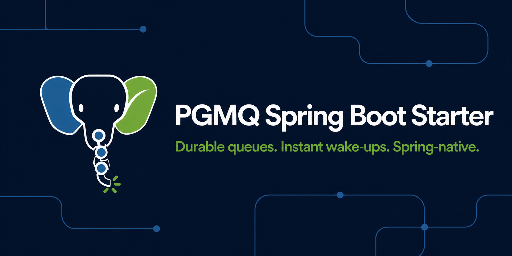
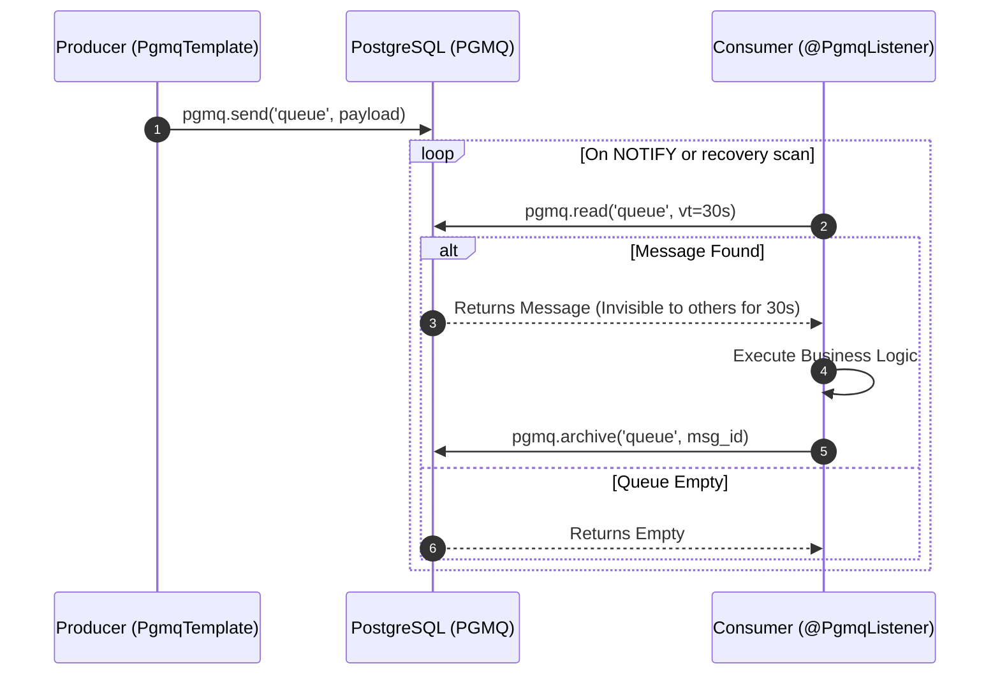
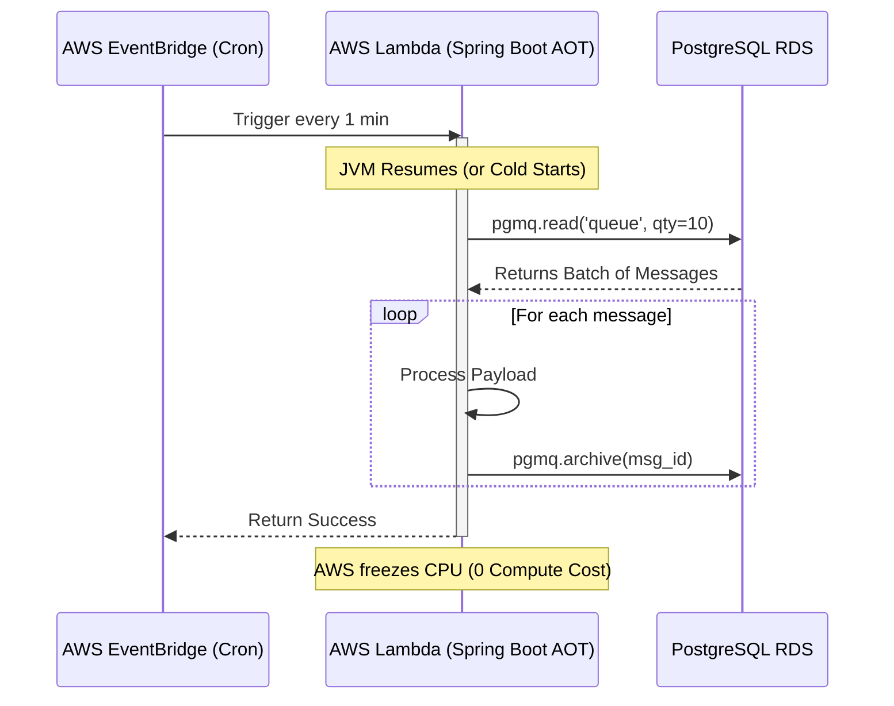
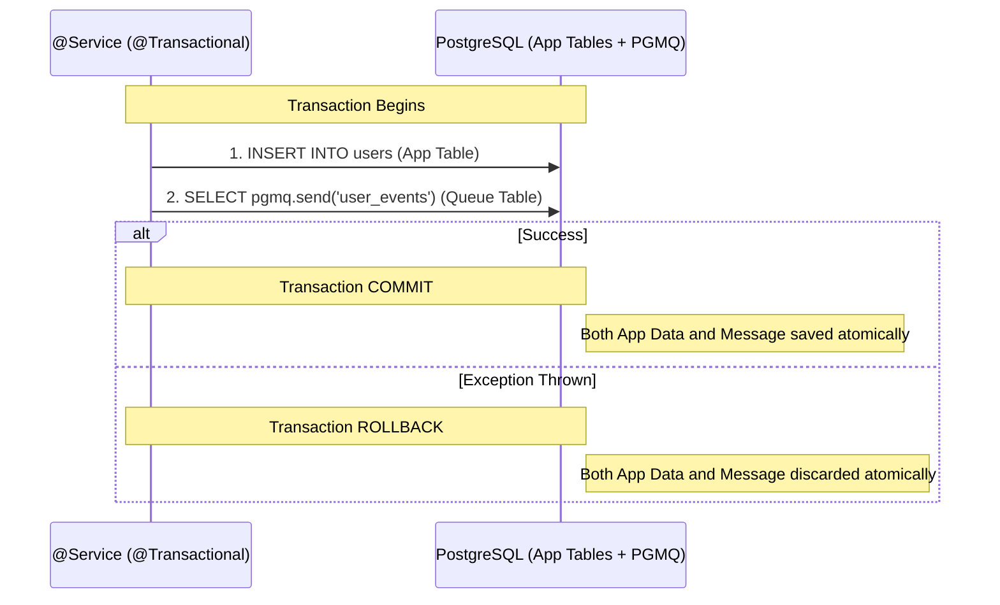

<div align="center">
  
  <h1>PGMQ Spring Boot Starter</h1>
  <p><b>Durable queues. Instant wake-ups. Spring-native.</b></p>
  <p>An idiomatic Spring Boot integration for PostgreSQL Message Queue.</p>
  <p>
    
    
    
    
    
  </p>
</div>

<br/>

> **Release 0.1.0.** Covered by unit and integration tests against PostgreSQL with PGMQ. Its first
> production use is [MonoPath](https://monopath.app/), a puzzle game, for reminder delivery and
> background work. Reports and contributions are welcome.

---

> **Use PostgreSQL for application-scale asynchronous work.** When your data is
> already in PostgreSQL, PGMQ can remove a separate broker from workloads that
> do not require Kafka- or RabbitMQ-specific capabilities.

This library acts as a native Spring Boot Auto-Configuration module bridging the gap between the [PGMQ](https://github.com/tembo-io/pgmq) extension and the Spring ecosystem. It provides an intuitive `@PgmqListener` annotation and a powerful `PgmqTemplate`, mirroring the developer experience of Spring Kafka or Spring AMQP, while unlocking the ACID guarantees of PostgreSQL.

---

## ✨ Features at a Glance

- **Declarative Consumers:** Simply annotate methods with `@PgmqListener(queue = "my_queue")`.
- **Transactional Outbox Built-in:** Send messages safely within your standard `@Transactional` database methods.
- **Poison Pill Handling:** Automatic routing to Dead Letter Queues (DLQ) after a configurable number of retries.
- **Exponential Backoff:** Circuit-break failing external APIs by dynamically scaling visibility timeouts.
- **Transactional Deduplication:** Coordinate same-database listener work,
  message finalization, and processed-message tracking in one transaction.
- **High Throughput Batching:** Process messages in bulk by accepting `List<T>` parameters.
- **Concurrent Consumer Scaling:** Spin up multiple parallel threads per queue effortlessly.
- **Complementary Notification Wake-ups:** Combine durable PGMQ reads with native PostgreSQL
  `LISTEN/NOTIFY` for fast wake-ups and periodic polling for recovery.
- **Delayed Messaging:** Schedule work for the future without needing Quartz or Cron.
- **Cloud-Native Configuration:** Full SpEL support (`${app.queue.name}`) for Kubernetes ConfigMaps.
- **Day-2 Observability:** Deep integration with Micrometer (Prometheus) exposing throughput, latency, and queue depth metrics.
- **AOT Integration:** Runtime-hint infrastructure for Spring native-image applications.

---

## 🚀 Quick Start

### 1. Prerequisites
- Java 17+
- Spring Boot 4.0+
- PostgreSQL database with the `pgmq` extension installed. *(See the [PGMQ documentation](https://github.com/tembo-io/pgmq) for installation instructions).*

### 2. Dependency
Releases are published to **GitHub Packages**. Add the repository and the starter to your `pom.xml`:

```xml
<repositories>
    <repository>
        <id>github</id>
        <url>https://maven.pkg.github.com/esgaltur/pgmq-spring-boot-starter</url>
    </repository>
</repositories>

<dependency>
    <groupId>io.github.esgaltur</groupId>
    <artifactId>pgmq-spring-boot-starter</artifactId>
    <version>0.1.0</version>
</dependency>
```

Gradle (Kotlin DSL):

```kotlin
repositories {
    maven("https://maven.pkg.github.com/esgaltur/pgmq-spring-boot-starter") {
        credentials {
            username = System.getenv("GITHUB_ACTOR")
            password = System.getenv("GITHUB_TOKEN")
        }
        content { includeGroup("io.github.esgaltur") }
    }
}
dependencies { implementation("io.github.esgaltur:pgmq-spring-boot-starter:0.1.0") }
```

GitHub Packages asks for a token even for public packages: in GitHub Actions the workflow's
`GITHUB_TOKEN` works; elsewhere use a personal token with `read:packages`, or build the starter
locally with `mvn install` and resolve it from the local Maven repository.

### JSON: Jackson 3 and Jackson 2

Payloads are serialized with the application's own Jackson mapper, so they follow its modules and
settings. `spring.pgmq.json` chooses: `auto` (default) uses the application's Jackson 3 mapper (Spring
Boot 4's default), else its Jackson 2 mapper, else a default Jackson 3 mapper; `jackson3` and
`jackson2` force one. Provide your own `PgmqPayloadCodec` bean for anything else.

### 3. Configuration
Configure your standard Spring Boot datasource and optional PGMQ properties in `application.yml`:

```yaml
spring:
  datasource:
    url: jdbc:postgresql://localhost:5432/mydb
    username: myuser
    password: mypassword

  pgmq:
    auto-create-queue: true    # Automatically creates queues used by listeners
    listener-mode: polling     # Safe default; set notify to opt in
    notification-recovery-interval: 30s # Safety scan for missed signals
    notification-reconnect-interval: 1s # Retry delay after LISTEN failure
    notification-throttle-interval: 250ms # Coalesce burst notifications
    notification-wakeup-jitter: 25ms # Spread competing reads across replicas
    coordinate-notification-wakeups: true # Lease one immediate read across replicas
    notification-wakeup-lease: 1s # Short lease; must be below recovery interval
    schedule-delayed-messages: true # Wake near delayed/retry visibility time
    default-vt: 30             # Default Visibility Timeout in seconds
    default-poll-interval: 500 # Default polling interval in milliseconds
    shutdown-timeout: 10s      # Grace period for in-flight messages during JVM shutdown
```

---

## 🛠️ Core Concepts

### Producing Messages

Inject `PgmqTemplate` into your services. The template automatically serializes your Java objects to JSONB using your application's `ObjectMapper`.

```java
import io.github.pgmq.core.PgmqTemplate;
import org.springframework.stereotype.Service;

@Service
public class OrderService {
    
    private final PgmqTemplate pgmqTemplate;

    public OrderService(PgmqTemplate pgmqTemplate) {
        this.pgmqTemplate = pgmqTemplate;
    }

    public void processOrder(Order order) {
        // Send a message immediately
        pgmqTemplate.send("order_queue", new OrderEvent(order.getId(), "CREATED"));
    }
}
```

### Consuming Messages

Annotate a Spring bean method with `@PgmqListener`. The library handles notification-driven wake-up, recovery polling, JSON deserialization, and generic type resolution.

Notification mode uses one dedicated JDBC connection per application instance and
requires PGMQ's `enable_notify_insert` function. If notifications cannot be enabled,
the affected queue automatically falls back to its configured `pollInterval`.
For production, notification triggers can be managed in migrations by setting
`auto-enable-notifications: false`. See the measured
[listener wake-up mode comparison](docs/LISTEN_NOTIFY_COMPARISON.md).

`LISTEN/NOTIFY` is only the wake-up mechanism. The PGMQ extension is still
required and remains responsible for durable message storage and consumption.
Notifications are transient hints; periodic recovery reads ensure a missed
signal delays processing rather than losing a message.

Removing PGMQ would require this starter to implement its own durable queue
tables, transactional message claiming, retries, and visibility timeouts.
`LISTEN/NOTIFY` alone is suitable only for best-effort broadcasts where losing
an event while a consumer is disconnected is acceptable.

### Complementary listener architecture

Notification mode combines three responsibilities rather than replacing one
queue implementation with another:

```text
PGMQ durable queue ───────────────> pgmq.read() ──> listener method
       │                                ▲
       └─ committed insert ─> NOTIFY ───┤ fast wake-up
                                        │
                    recovery timer ─────┘ missed/delayed-message safety
```

Consumers always claim and load messages through PGMQ. A notification or timer
only decides when an idle consumer should perform its next durable queue read.


```mermaid
sequenceDiagram
    autonumber
    participant P as Producer (PgmqTemplate)
    participant DB as PostgreSQL (PGMQ)
    participant C as Consumer (@PgmqListener)
    
    P->>DB: pgmq.send('queue', payload)
    loop On NOTIFY or recovery scan
        C->>DB: pgmq.read('queue', vt=30s)
        alt Message Found
            DB-->>C: Returns Message (Invisible to others for 30s)
            C->>C: Execute Business Logic
            C->>DB: pgmq.archive('queue', msg_id)
        else Queue Empty
            DB-->>C: Returns Empty
        end
    end
```

```java
import io.github.pgmq.annotation.PgmqListener;
import org.springframework.stereotype.Component;

@Component
public class OrderWorker {

    // Consume just the payload
    @PgmqListener(queue = "order_queue")
    public void handleOrderEvent(OrderEvent event) {
        System.out.println("Processing order: " + event.getOrderId());
        // If this method returns normally, the message is archived.
        // If it throws an Exception, the message is ignored and redelivered after the VT expires.
    }

    // Or consume the full metadata envelope
    @PgmqListener(queue = "analytics_queue")
    public void handleFullMessage(PgmqMessage<AnalyticsEvent> message) {
        System.out.println("Message ID: " + message.getMsgId());
        System.out.println("Enqueued At: " + message.getEnqueuedAt());
    }
}
```

## 🎯 Common Use Cases

Why choose Postgres for messaging instead of Kafka, RabbitMQ, or AWS SQS?

1. **The Startup & MVP:** You are building a new project. You need background jobs (like sending welcome emails or processing images) but you don't want the DevOps overhead of maintaining a separate RabbitMQ cluster. 
2. **The "Outbox" System:** Your primary data is in Postgres. You need to save a database record and emit an event atomically. Using PGMQ avoids the notorious "Dual Write" problem entirely without needing complex CDC tools like Debezium.
3. **The Microservices Diet:** Your architecture has become bloated with too many moving parts. Consolidating your message queue into your existing managed Postgres instance (like AWS RDS or Google Aurora) drastically reduces infrastructure costs and cognitive load.
4. **Serverless / Edge Deployments:** Because this library is fully GraalVM Native Image compatible, you can deploy Spring Boot lambdas that connect to your database and process queues instantly without JVM warmup times.

### Choosing notification or polling mode

Use `notify` mode for transactional outbox events, email and webhook
jobs, workflow steps, and other sparse or bursty queues where low idle-to-active
latency matters. It is best suited to continuously running applications with a
small or moderate number of replicas and room for one dedicated PostgreSQL
connection per instance.

Use `polling` for permanently busy queues, maximum-rate telemetry or bulk
ingestion, very large consumer fleets, strict connection budgets, or workloads
dominated by delayed messages and visibility-timeout retries. Polling is also
the compatible option when PGMQ notification functions or trigger-management
permissions are unavailable.

For PgBouncer, the LISTEN connection requires session affinity: use a direct
PostgreSQL connection or session pooling, not transaction pooling. See the full
[use-case and mode-selection guide](docs/LISTEN_NOTIFY_COMPARISON.md#recommended-use-cases).

Modes can be selected per queue while retaining the application-wide default:

```java
@PgmqListener(queue = "interactive_jobs", mode = PgmqListenerMode.NOTIFY)
public void handleInteractiveJob(Job job) {
    // Notification-assisted durable reads.
}

@PgmqListener(queue = "telemetry", mode = PgmqListenerMode.POLLING)
public void handleTelemetry(List<TelemetryEvent> events) {
    // Fixed-delay reads for a continuously busy queue.
}
```

Listeners sharing one queue must select the same mode; conflicting declarations
fail during application startup.

---

## ☁️ Serverless Usage (AWS Lambda & Fargate)

How you consume messages in a Serverless environment depends entirely on your compute model.

### 1. Serverless Containers (AWS Fargate, Google Cloud Run)
If you are deploying your Spring Boot app as a Docker container that runs continuously, simply use the `@PgmqListener` annotation exactly as documented. The background threads will consume from the database while the container is active.

### 2. Serverless Functions (AWS Lambda)
**Do not use `@PgmqListener` in AWS Lambda.** 
When an AWS Lambda function finishes handling a request, AWS *freezes* the CPU. Any background listener threads will be suspended, delaying message processing until the function resumes.

Instead, configure an Amazon EventBridge Scheduler to trigger your Lambda every minute, and use the `PgmqTemplate.read()` or `PgmqTemplate.pop()` method synchronously inside your function handler:


```mermaid
sequenceDiagram
    participant EB as AWS EventBridge (Cron)
    participant L as AWS Lambda (Spring Boot AOT)
    participant DB as PostgreSQL RDS
    
    EB->>L: Trigger every 1 min
    activate L
    Note over L: JVM Resumes (or Cold Starts)
    L->>DB: pgmq.read('queue', qty=10)
    DB-->>L: Returns Batch of Messages
    loop For each message
        L->>L: Process Payload
        L->>DB: pgmq.archive(msg_id)
    end
    L-->>EB: Return Success
    deactivate L
    Note over L: AWS freezes CPU (0 Compute Cost)
```

```java
import org.springframework.stereotype.Component;
import java.util.function.Function;

@Component
public class LambdaQueueWorker implements Function<Object, String> {

    private final PgmqTemplate pgmqTemplate;

    public LambdaQueueWorker(PgmqTemplate pgmqTemplate) {
        this.pgmqTemplate = pgmqTemplate;
    }

    @Override
    public String apply(Object awsEvent) {
        // Synchronously fetch up to 10 messages
        List<PgmqMessage<OrderEvent>> batch = pgmqTemplate.read("order_queue", 30, 10, OrderEvent.class);
        
        for (PgmqMessage<OrderEvent> msg : batch) {
            try {
                process(msg.getPayload());
                pgmqTemplate.archive("order_queue", msg.getMsgId());
            } catch (Exception e) {
                // Ignore. Message remains in queue and becomes visible again after 30s.
            }
        }
        
        return "Processed " + batch.size() + " messages.";
    }
}
```

The starter contributes an AOT runtime-hint hook. Native-image applications
should still run Spring's native test/build workflow for their own listener
payloads and reflected methods.

---

## 🏰 Enterprise Architecture Patterns

### The Transactional Outbox Pattern (Built-in)
Because PGMQ uses standard PostgreSQL tables, it intrinsically participates in your Spring Boot `@Transactional` contexts without any complex Kafka Connect or Debezium setups.


```mermaid
sequenceDiagram
    participant S as @Service (@Transactional)
    participant DB as PostgreSQL (App Tables + PGMQ)
    
    Note over S, DB: Transaction Begins
    S->>DB: 1. INSERT INTO users (App Table)
    S->>DB: 2. SELECT pgmq.send('user_events') (Queue Table)
    alt Success
        Note over S, DB: Transaction COMMIT
        Note right of DB: Both App Data and Message saved atomically
    else Exception Thrown
        Note over S, DB: Transaction ROLLBACK
        Note right of DB: Both App Data and Message discarded atomically
    end
```

```java
@Transactional
public void createUser(User user) {
    repository.save(user); // 1. Save to standard Postgres table
    
    pgmqTemplate.send("user_events", new UserCreatedEvent(user.getId())); // 2. Write to PGMQ
    
    // If an Exception is thrown here, BOTH the repository save 
    // AND the message queue insertion are rolled back!
}
```

### Delayed Messaging (Scheduling)
Need to schedule work for the future? Send a message with a built-in visibility delay. It remains invisible to all consumers until the delay expires.

```java
// Send a reminder email that will only become visible in exactly 3 hours (10,800 seconds)
pgmqTemplate.sendWithDelay("email_queue", emailPayload, 10800);
```

### High-Throughput Batch Processing
Consume messages in batches by defining a `List` parameter. Extremely efficient for bulk database inserts.

```java
@PgmqListener(queue = "telemetry_queue", qty = 100)
public void handleBatch(List<TelemetryEvent> events) {
    // Receives up to 100 events at once in a single SQL roundtrip.
    bulkInsertRepository.saveAll(events);
}
```

### Transactional Deduplication
PGMQ provides at-least-once delivery. Enabling `idempotent` records successfully
processed message IDs in `pgmq_idempotency`. Listener database work using the
same transaction manager, the idempotency marker, and PGMQ archive/delete are
committed or rolled back together.

```java
@PgmqListener(queue = "payment_queue", idempotent = true)
public void processPayment(PaymentEvent event) {
    // Completed message IDs are skipped on later redelivery.
}
```

This is deduplication, not a universal exactly-once guarantee. External side
effects such as HTTP calls can still happen twice if the process fails after the
remote system accepts the call but before the database transaction commits.
Use an idempotency key accepted by the remote system for those integrations.

### Poison Pill Handling (Dead Letter Queues)
If a payload is malformed, throwing exceptions repeatedly causes an infinite loop. Route poison pills safely to a DLQ.

```java
@PgmqListener(queue = "invoice_queue", maxRetries = 3, deadLetterQueue = "invoice_dlq")
public void handle(InvoiceEvent event) {
    // If this throws an exception 3 times, the message is automatically 
    // moved to 'invoice_dlq' and removed from 'invoice_queue'.
}
```

### Exponential Backoff
Protect failing downstream dependencies (like external APIs) from being hammered.

```java
@PgmqListener(
    queue = "api_queue", 
    vt = 10,                 // Base VT of 10 seconds
    backoffMultiplier = 2.0, // Retry 1: 20s, Retry 2: 40s, Retry 3: 80s
    maxBackoff = 3600        // Cap backoff at 1 hour
)
public void callExternalApi(ApiEvent event) {
    // Exceptions trigger dynamic scaling of the visibility timeout
}
```

### Dynamic SpEL Configuration & Scaling
Do not hardcode queue names! Inject them dynamically per environment, and scale thread concurrency based on workloads.

```yaml
# application.yml
app:
  queues:
    orders: prod_orders_v1
    orders-concurrency: 5
```

```java
@PgmqListener(
    queue = "${app.queues.orders}", 
    concurrency = "${app.queues.orders-concurrency:1}"
)
public void handle(OrderEvent event) {
    // Spins up 5 independent consumer workers for 'prod_orders_v1'
}
```

### Database Schema Management (Flyway / Liquibase)
By default, the starter creates the PGMQ extension and its small support tables
for idempotency and cross-instance wake-up coordination using Spring's database
initializer.

**For Production Environments**, it is an industry standard to manage schemas explicitly via Flyway or Liquibase. You can disable the library's auto-DDL and run the SQL yourself:

```yaml
spring:
  pgmq:
    initialize-schema: never
```

Then, copy the contents of our bundled `schema-pgmq.sql` into your own migration script:
```sql
CREATE EXTENSION IF NOT EXISTS pgmq CASCADE;

CREATE TABLE IF NOT EXISTS pgmq_idempotency (
    queue_name VARCHAR(255) NOT NULL,
    msg_id BIGINT NOT NULL,
    created_at TIMESTAMP DEFAULT CURRENT_TIMESTAMP,
    PRIMARY KEY (queue_name, msg_id)
);

CREATE TABLE IF NOT EXISTS pgmq_listener_wakeup_lease (
    queue_name VARCHAR(255) PRIMARY KEY,
    owner_id VARCHAR(36) NOT NULL,
    lease_until TIMESTAMPTZ NOT NULL
);
```

---

## 📊 Observability (Micrometer & KEDA)

If `io.micrometer:micrometer-core` is on the classpath, the library automatically registers:
- `pgmq.messages.processed` (Counter): Tagged by `queue` and `status` (`success`, `failure`, `dlq`).
- `pgmq.listener.latency` (Timer): Track method execution durations.
- `pgmq.queue.depth` (Gauge): Emits the current length of the queue.
- `pgmq.listener.connected` (Gauge): Dedicated LISTEN connection state.
- `pgmq.listener.notifications` and `pgmq.listener.reconnects` (Counters): Notification lifecycle.
- `pgmq.listener.recovery.scans`, `pgmq.listener.scheduled.wakeups`, and
  `pgmq.listener.polling.wakeups` (Counters): Why idle workers resumed.
- `pgmq.listener.suppressed.wakeups` (Counter): Replica wake-ups suppressed by
  the short cross-instance lease.
- `pgmq.listener.queue.reads`, `pgmq.listener.empty.reads`, and
  `pgmq.listener.poll.failures` (Counters): Database-read behavior and failures.

When Spring Boot health support is present, the `pgmqListener` health component
reports active queues, their effective modes and fallback reasons, LISTEN state,
reconnects, notifications, recovery scans, and empty reads. A disconnected
notification connection reports `DEGRADED` while durable recovery remains active.

Applications may also inject `PgmqListenerStatus` and inspect its immutable
snapshot without Actuator.

### Dedicated LISTEN datasource

Notification mode uses one session-scoped connection. To keep it away from a
transaction-pooled PgBouncer endpoint or the application's main Hikari budget,
provide a datasource qualified with `@PgmqNotificationDataSource`:

```java
@Bean
@PgmqNotificationDataSource
DataSource pgmqListenDataSource() {
    return DataSourceBuilder.create()
            .url(directPostgresUrl)
            .username(username)
            .password(password)
            .build();
}
```

Without this bean, the primary application datasource is used.

**Kubernetes Autoscaling:** By exposing the `pgmq.queue.depth` gauge to Prometheus, DevOps teams can seamlessly bind **KEDA** (Kubernetes Event-driven Autoscaling) to horizontally autoscale your Spring Boot pods based purely on Consumer Lag.

---

## 🧪 Testing

We believe in testing against real infrastructure. This project uses **Testcontainers** to spin up a real PostgreSQL instance during the `mvn test` phase.

The test suite validates complex asynchronous mechanics, race conditions, and transactional boundaries using the pinned `ghcr.io/pgmq/pg18-pgmq:v1.10.0` Docker image.

To run the suite locally, ensure your Docker daemon is running and execute:
```bash
mvn clean test
```

---

## 🤝 Contributing
Contributions, issues, and feature requests are highly welcome! 
1. Fork the Project
2. Create your Feature Branch (`git checkout -b feature/AmazingFeature`)
3. Commit your Changes (`git commit -m 'Add some AmazingFeature'`)
4. Push to the Branch (`git push origin feature/AmazingFeature`)
5. Open a Pull Request

Visual identity, palette, and asset usage are documented in the
[brand guide](docs/BRAND.md).

## 📄 License
This project is licensed under the MIT License - see the `LICENSE` file for details.
